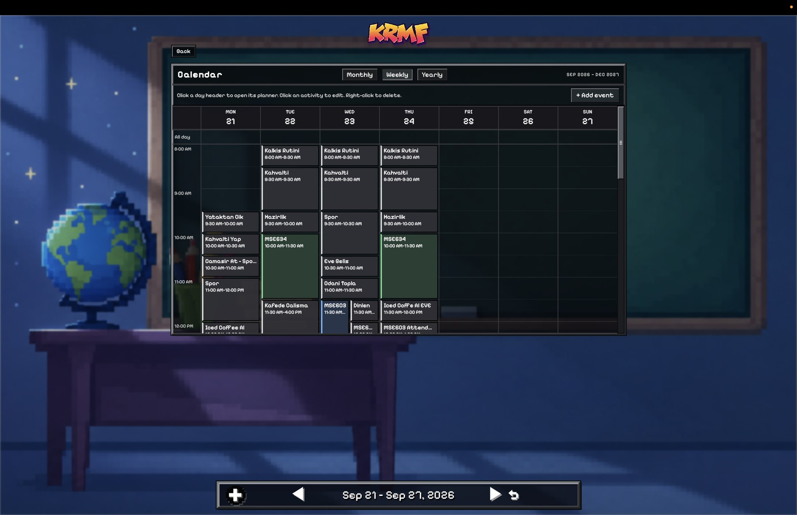
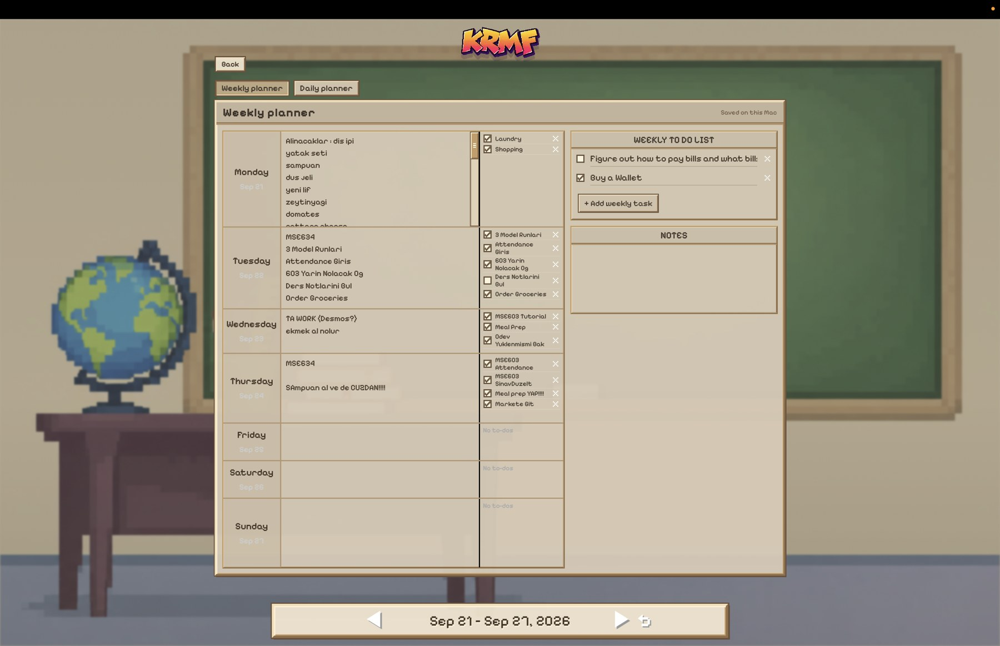
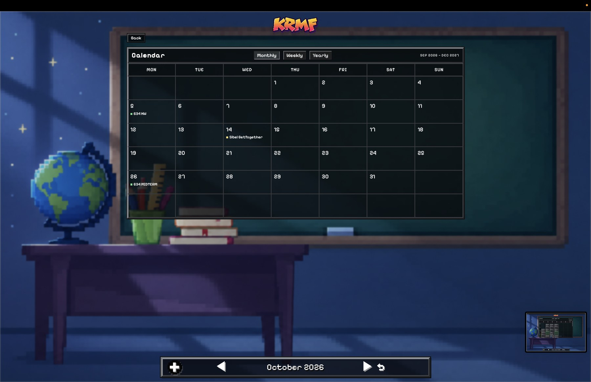
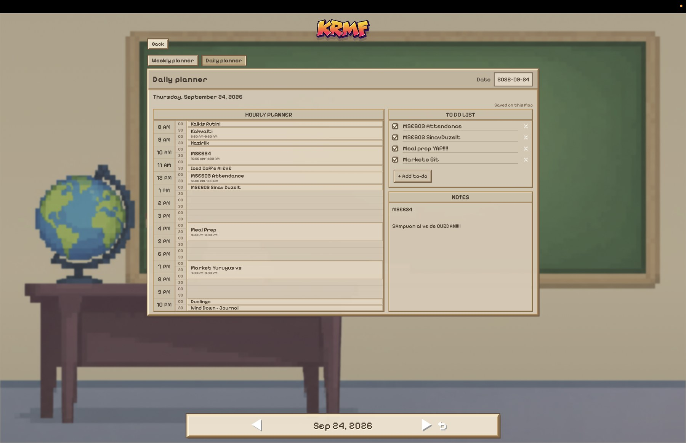
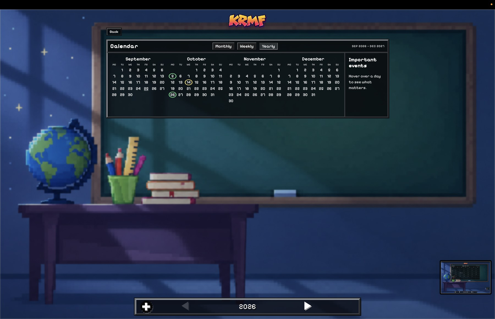
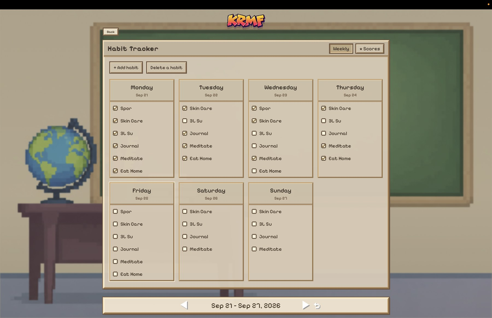
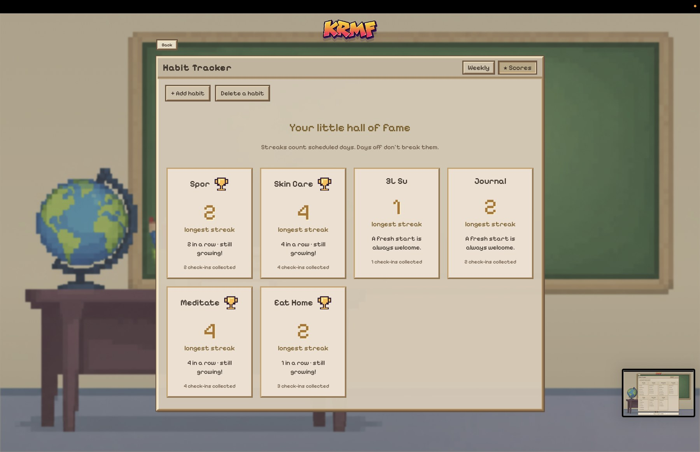

# KRMF 

A tiny pixel app for keeping life together.

## Download for Mac 🍎

**[Download KRMF 0.1.1](downloads/KRMF-0.1.1-macOS-Apple-Silicon.dmg?raw=1)**

This edition keeps everything locally on your Mac. No account needed.

## Functionality

-  **Calendar** — see your month, week, and important moments.
-  **Daily planner** — Plan every hour and leave notes for yourself.
-  **Weekly planner** — see the whole week in one screen.
-  **To-dos** — check things off
-  **Habits** — you = your habits.
-  **Mac widgets** - Desktop widgets for hourly planner and to-do list.
-  **Web companion** — Almost exactly the same experience accessible through web. (For me though I need to work on some stuff to make it public ?:P)
-  **Light and dark modes**

Your Mac app and web companion stay in sync.

## A peek inside ✨

| Calendar | Planner |
| --- | --- |
|  |  |
|  |  |
|  |  |

*Il faut cultiver notre jardin.* 🌿
